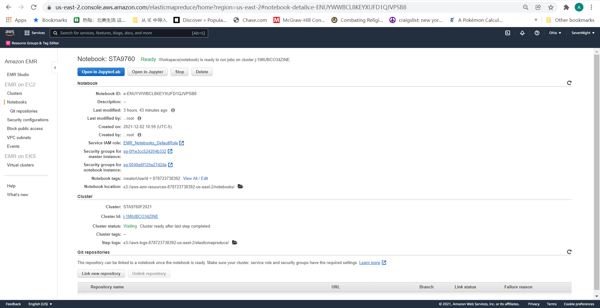
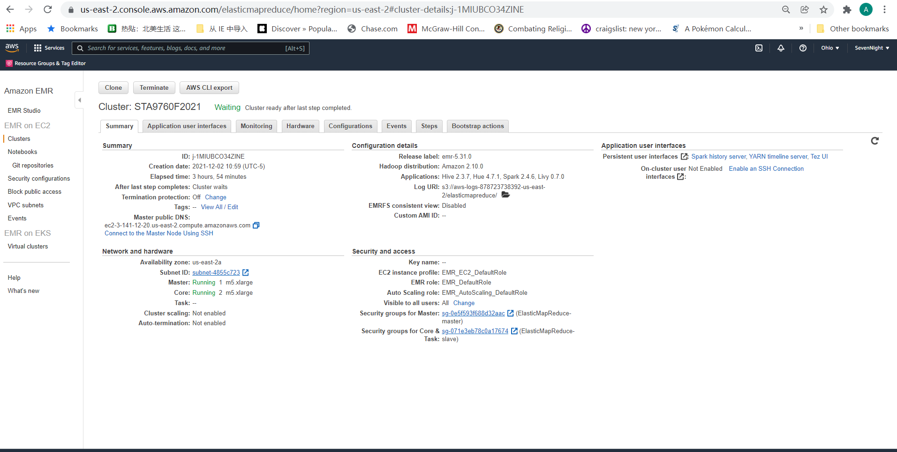

# Analyzing 10Gb of Yelp Reviews Data

We will analyze a subset of Yelp's business, reviews and user data. This dataset comes to us from [Kaggle](https://www.kaggle.com/yelp-dataset/yelp-dataset) although we have taken steps to pull this data into a publis s3 bucket: `s3://yelpyifei/yelp/*.json`

## [Analysis](https://github.com/YifeiG/project-02/blob/main/Analysis.ipynb)

Note that the output of the code written is provided as a means to give you structure as you write your analysis. For **Parts I, II & III**, you must fill in the blanks (however way you want) to get the output provided in the file. (Mainly columns and aggregations, I don't care about the exact rows). For **Parts III and IV**, you are more flexibility to take the analysis further however you see fit.
Part I:
Install all pacakges that we need for this project and import them when we need.
Creat AWS cluster and notebook. It takes time to make both running.
Then upload dataset to S3. It takes around 2 hour to upload a 10G folder.
After finish all these, it is time to start analysis.

Part II:
First step is read the json file and select five columns we need.
Then follow the requirment step to draw the graph. 

Part III:
First step is read the json file and select several columns we need.
Join the new file with previous one to get the new table we need.
Calculate the skew we need and graph it.

Patr IV:
First step is read the json file and select several columns we need.
Join the new file with previous one to get the new table we need.
Do some visuliaztion graph.

## Cluster and Notebook Configs

